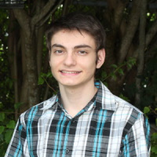

# Bios

Please add here a 2-3 paragrapgh professional Bio. Look up who a professional 
bio is isn IEEE papers. Write in 3rd person. TOD: provide link example.

Review other peoples bios and improve or give improvement tips where needed.

If it turns out you never contributed to anything, your bio will be removed 
(as well as your name in this proceedings).

## Paul Kiattikhunphan

Paul Kiattikhunphan is a second year at the University of Virginia majoring in computer science. 

## Alex Beck

Alex is a first year student at the University of Virginia majoring in electrical engineering.

## Alison Lu

Alison Lu has completed her second year at the University of Virginia pursuing a
double major in CS and Chemistry with a minor in Japanese.
She is currently participating in research.

## Jackson Miskill

Jackson Miskill has completed his second year at the University
of Virginia where he is studying Computer Science and Cognitive
Science. He will receive a Bachelor of Arts degree from UVa in
Spring of 2024. 

Jackson has worked in a variety of different environments:
restaurant, coffee shop, environmental science organization,
and nonprofit. He is currently working in research at the 
UVA Biocomplexity Institute where he is planning to learn as much
as possible about programming, data science, and academic research.

At UVA, Jackson is active in organizations that he is passionate
about. He volunteers for the National Alliance on Mental 
Illness in the outreach committee, served as recruitment chair
for Phi Delta Theta and treasurer of Phi Alpha Delta, and 
volunteers with Madison House in the Casa Alma organization. 

## Jacques Fleischer

Jacques Fleischer is a sophomore at the Miami Dade Honors College. 
He is set to receive his associate degree in computer science in 
summer 2022. He received the Miami Dade Honors College Fellows 
Award and currently maintains a 4.0 GPA on the Dean’s List.

In the summer of 2021, he participated in the Florida-Georgia 
Louis Stokes Alliance for Minority Participation REU Data
Science and AI Research Program; his research focused on 
predicting the price of cryptocurrency using artificial
intelligence. This was done in conjunction with faculty from 
Florida A&M University and Indiana University. He presented
his findings at the Miami Dade College School of Science 
Symposium in October 2021. Jacques was accepted to the 2022
Emerging Researchers National (ERN) Conference in STEM after 
applying with his abstract on cryptocurrency time-series.
Additionally, he was one of four Miami Dade College students 
to be nominated for the Barry Goldwater Scholarship due to
his research findings.

Jacques is active in extracurriculars; for instance, he is the 
current Vice President of the MDC Computer Club. There, he hosts 
virtual workshops on how to use computer software, including 
Adobe Premiere Pro and PyCharm. He is also a member of Phi Theta 
Kappa. Furthermore, he is an active contributor to Cloudmesh: an 
open-source, all-in-one grid-computing solution written in 
Python. He presently participates in the University of Virginia’s 
Computing for Global Challenges program with Dr. 
Gregor von Laszewski and Dr. Geoffrey C. Fox to find high 
performance computing solutions using Raspberry Pis.

## Eric He

TBD

## Abdulbaqiy Diyaolu

AbdulBaqiy Diyaolu is a Computer science and Mathematics Major from
Mississippi Valley State University.

