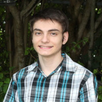

# Bios

Please add here a 2-3 paragrapgh professional Bio. Look up who a professional 
bio is isn IEEE papers. Write in 3rd person. TOD: provide link example.

Review other peoples bios and improve or give improvement tips where needed.

If it turns out you never contributed to anything, your bio will be removed 
(as well as your name in this proceedings).

## Alex Beck

Alex Beck has completed his first year at the University of Virginia where he is 
majoring in electrical engineering. He is set to receive his Bachelor of Science degree
in the Spring of 2025. He currently maintains a 3.9 GPA. 

Alex is currently working in research this summer at the UVA Biocomplexity Institute's
Computing for Global Challenges program under Dr. Gregor Von Laszewski and Dr. Geoffrey
Fox where he is planning to gain experience in programming and data science. Prior to 
that, he has previous experience in sales from working in retail. 

At UVA, Alex is involved in a few extracurricular organizations. He is currently active
in the Virginia Eta Chapter of Sigma Phi Epsilon, the UVA Climbing Team, and the 
UVA Chapter of the QuestBridge Scholars Network.

## Alison Lu

Alison Lu has completed her second year (Class of 2024) at the University of Virginia pursuing a
double major in CS and Chemistry with a minor in Japanese. She is conducting research with the
physics department studying quantum computing and photon resolution using machine learning. In 
addition, she works with UVA's Repair Lab to study gentrification in Norfolk, VA.

She is currently participating in the Biocomplexity Institute's C4GC REU program. Her interests
include computer architecture, machine learning, and quantum computing alongside quantum mechanics.

## Jackson Miskill

Jackson Miskill has completed his second year at the University
of Virginia where he is studying Computer Science and Cognitive
Science. He will receive a Bachelor of Arts degree from UVa in
Spring of 2024. Jackson has studied python and java in his courses,
delving into concepts from basic syntax to data structures and algorithms. 

Jackson is currently working at the UVa Biocomplexity Institute 
under Dr. Gregor von Laszewski as a part of the Computing for 
Global Challenges program. He is studying the intersection
between python and cloud computing. In the future, Jackson plans
to continue research. 

## Jacques Fleischer

Jacques Fleischer is a sophomore at the Miami Dade Honors College. 
He is set to receive his associate degree in computer science in 
summer 2022. He received the Miami Dade Honors College Fellows 
Award and currently maintains a 4.0 GPA on the Dean’s List.

In the summer of 2021, he participated in the Florida-Georgia 
Louis Stokes Alliance for Minority Participation REU Data
Science and AI Research Program; his research focused on 
predicting the price of cryptocurrency using artificial
intelligence. This was done in conjunction with faculty from 
Florida A&M University and Indiana University. He presented
his findings at the Miami Dade College School of Science 
Symposium in October 2021. Jacques was accepted to the 2022
Emerging Researchers National (ERN) Conference in STEM after 
applying with his abstract on cryptocurrency time-series.
Additionally, he was one of four Miami Dade College students 
to be nominated for the Barry Goldwater Scholarship due to
his research findings.

Jacques is active in extracurriculars; for instance, he is the 
current Vice President of the MDC Computer Club. There, he hosts 
virtual workshops on how to use computer software, including 
Adobe Premiere Pro and PyCharm. He is also a member of Phi Theta 
Kappa. Furthermore, he is an active contributor to Cloudmesh: an 
open-source, all-in-one grid-computing solution written in 
Python. He presently participates in the University of Virginia’s 
Computing for Global Challenges program with Dr. 
Gregor von Laszewski and Dr. Geoffrey C. Fox to find high 
performance computing solutions using Raspberry Pis.

## Eric He

Junyang (Eric) He completed his first year of study at the University of 
Virginia majoring in Computer Science. He anticipates to receive his B.S. in 
Computer Science in 2025. He is currently a member of the Engineering Student
Council and the Chinese Student and Scholars Society at UVA.

In the summer of 2021, Eric worked as a Data Analyst intern at Nint (Shanghai)
Co., Ltd, a company that provides market data analysis products for E-commerce
His work included time series data cleaning and natural language processing.

Eric is currently conducting research with Prof. Geoffrey C. Fox on a 
Deep Learning model based on LSTM networks trained to predict hydrological 
features like streamflow, precipitation, and temperature at different locations 
in the US. He focused primarily on the possibilities of extending the model to 
countries outside of the US such as Chile and UK. 

## Abdulbaqiy Diyaolu
 
AbdulBaqiy Diyaolu is a Computer science and Mathematics Major from
Mississippi Valley State University. He will be receiving his bachelor's 
degrees in both Computer science and Mathematics in the year 2025. 
AbdulBaqiy is currently a presidential scholar at 
Mississippi Valley State University and he maintains a 4.0 GPA.

AbdulBaqiy currently works at Fedex Logistics at MVSU. He helps in
data entry and data Analysis. He is hoping to polish his data analysis
skills with this opportunity. In the summer of 2022, he joins the Bio 
complexity research program at UVA where he will be able to use his skills
in support of different researches, and also learn more research skills along
the way.

Abdulbaqiy participates in several extracurricular activities in MVSU he
is a member of African Student Union(ASU), National Society of Black engineers
(NSBE), and the google developer's club. He is also a Strada scholar at MVSU
where he participates in several leadership development activities.

## Thomas Butler

Thomas Butler is a Graduate Student at University of Virginia's School of Data 
Science. His undergraduate degree is in Biomedical engineering. He has over 
eight years of experience in the Infertility field helping patients, jointly 
running a Andrology lab, and contributing research to advance the field through 
joint research on how AMH effects pregnancy outcomes and sperm antibodies effect 
PSA. He has a certificate in Data Analytics from Georgia Institute of Technology.

## Robert Knuuti

Robert Knuuti is a Graduate Student at University of Virginia's School of Data 
Science. He has over 10 years experience in system architecture and software 
engineering, and specializes in Development Operations and Cloud Computing. 
He has constructed air gapped Continuous Integration and Continuous Delivery 
systems for multiple organizations each supporting more than 100 developers 
and has facilitated the construction of repeatable, tractable builds for users 
of these systems.

## Jake Kolessar

Jake Kolessar is a Graduate Student at the University of Virginia's School 
of Data Science. He has a background in mechanical engineering and 2 years 
of experience as a Modeling, Simulation and Analysis Engineer. He has 
supported the software design and development of modeling capabilities for 
event simulation products as well as the integration of models into the 
simulation framework.

