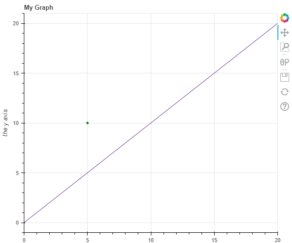
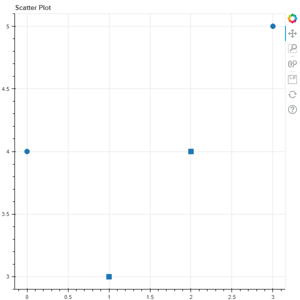
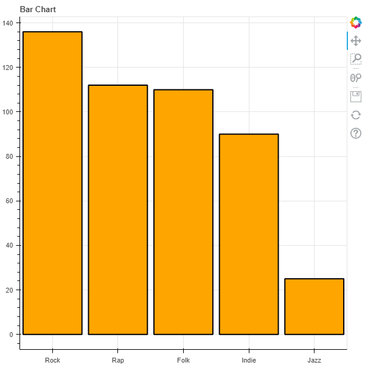

# Bokeh

Bokeh [@www-bokeh] is a Python library useful for generating visualizations for web
browsers. It generates graphics for all types of plots and dashboards
powered by JavaScript without the user’s need to write any JavaScript
code. The guide below will walk you through useful Bokeh commands and
features.

## Installation

To install Bokeh, please use the command:

```bash
$ pip install bokeh
```

## Import Statements

To plot figures, we import the `show` and `figure` functions from the
Bokeh libraries.

```python
from bokeh.io import show
from bokeh.plotting import figure
```

## Bokeh Plotting

`bokeh.plotting` is the library’s main interface. It gives the ability
to generate plots easily by providing parameters such as axes, grids,
and labels. The following code shows some of the simplest examples of
plotting a line and a point on a chart.

```python
from bokeh.io import show
from bokeh.plotting import figure

# labeling the title, specifying the range of the x-axis, labeling the
# y-axis, specifying the height to be 500 pxls

p = figure(title="My Graph", x_range=[0, 20], y_axis_label="the y axis",
           height=500)

# plotting a line from (0,0) to (20,20); any of the CSS colors can be
# used

p.line([0, 20], [0, 20], color='indigo')

# plotting a point (circle) at (5,10)
p.circle(5, 10, color='green')

show(p)
```

This program can be downloaded
from [GitHub](https://github.com/cybertraining-dsc/reu2022/tree/main/project/graphics/examples/bokeh-figure.py). The output is shown in @fig:bokeh-figure.


{#fig:bokeh-figure width=25%}

## Annotations

The titel can be set with **title**.
Bokeh allows setting annotations with the paarmeters **x_axis_label** and **y_axis_label**.
To set the range of the s and y axis you can use **x_range** and **y_range**. 

## Dimensions and Color 

The dimension of the plot can be set with **height** and **width**.
The background color can be changed with 
**background_fill_color**, however, we always want to set it to white for publications.

## Scatter Plot

The Bokeh library provides various marker shapes for marking
points on the scatter plot. The example below demonstrates
how to create a scatter plot with two points at locations
(1,3) and (2,4) respectively with circular and square marker
shapes. The size parameter controls the size of the marker.

```python
from bokeh.io import show
from bokeh.plotting import figure

p = figure(title="Scatter Plot")

# Circle
p.circle([0, 3], [4, 5], size=10)

# Square
p.square([1, 2], [3, 4], size=10)

show(p)
```

This program can be downloaded
from [GitHub](https://github.com/cybertraining-dsc/reu2022/tree/main/project/graphics/examples/bokeh-scatter.py). 
The output is shown in @fig:bokeh-scatter.


{#fig:bokeh-scatter width=50%} 

The list  possible marker types and the functions used to create
them can be found
[here](http://docs.bokeh.org/en/latest/docs/user_guide/plotting.html).

## Line Plots

The library provides a series of functions for creating various types
of line graphs ranging from a single line graph, step line graph,
stacked line graph, multiple line graph, and so on.

```python
from bokeh.io import show, export_png, export_svg
from bokeh.plotting import figure
import random

x = []
y = []
for i in range(0, 100):
  x.append(i)
  value = random.random() * 100
  y.append(value)

p = figure(title="Plot Test", x_axis_label="x", y_axis_label="y")
p.line(x, y)

show(p)
```

This program can be downloaded from
[GitHub](https://github.com/cybertraining-dsc/reu2022/tree/main/project/graphics/examples/bokeh-linechart.py)
The output is shown in @fig:bokeh-linechart.

{#fig:bokeh-linechart width=50%} 

You can find the source code for other types of line plots here:
<http://docs.bokeh.org/en/latest/docs/user_guide/plotting.html>

## Bar Chart

Similarly, the `hbar()` and `vbar()` functions can be used to display
horizontal and vertical bar graphs, respectively.

```python
from bokeh.io import show, export_png, export_svg
from bokeh.plotting import figure

data = {'Rock': 136, 'Rap': 112, 'Folk': 110, 'Indie': 90, 'Jazz': 25}
x = list(data.keys())
y = list(data.values())

p = figure(x_range=x, title="Bar Chart")

p.vbar(x=x, top=y, line_color='black', color='orange', width=0.9, line_width=2)

show(p)
```

This program can be downloaded from
[GitHub](https://github.com/cybertraining-dsc/reu2022/tree/main/project/graphics/examples/bokeh-barchart.py). The output is shown in @fig:bokeh-barchart.


{#fig:bokeh-barchart width=50%}

## Saving Figures

Bokeh supports outputs to a static HTML file with a specific name.

```python
from bokeh.plotting import output_file

output_file("name.html")
```

After importing the Bokeh plotting interface, it is possible to be
able to create different types of plots utilizing the figure created
with the figure function.

### Saving Figures as PNG

As the purpose of Bokeh is to create interactive `.html`
visualizations, it is recommended to keep your visualizations in this
format. However, it may sometime be necessary to save as an image
file.

In order to save figures as a PNG, both Selenium and a web driver will
need to be installed. We will use Chromium here for our web driver. To
install both at once, use the commands:

(Windows)

```bash
$ pip install selenium chromedriver-binary
$ pip install chromedriver-binary-auto
```

There seems to be issues installing `chromedriver-binary` on Mac
computers due to the built-in security, so it is recommended to simply
save Bokeh figures as a `.html` file.

When writing a program, Chromium must be added to the PATH through
these import statements:

```python
from selenium import webdriver
import chromedriver_binary
```

Bokeh appears to support saving files as a `.svg` but it seems to have
bugs and is not recommended. To use the functions, `export_png()` and
`export_svg()` must be imported, and can be used as follows:

```python
from bokeh.io import export_png, export_svg

export_png(fig, filename="file-name.png")
export_svg(fig, filename="file-name.svg")
```

Assignment:

* find out how to add a dpi to the png image. Set it to 300dpi.
* modify this document and the code accordingly

Note that Chromium is slow and this process may take delay the
execution and performance of the program.

Similarly to Matplotlib, Bokeh can utilize a function to save all
created images.

```python
from matplotlib import pyplot as plt
from bokeh.io import export_png, export_svg
import os


def save(p):
  name = os.path.basename(__file__).replace(".py", "")
  export_png(p, filename=f"images/{name}.png")
  export_svg(p, filename=f"images/{name}.svg")
  plt.show(p)
```

This code can be accessed on
[GitHub](https://github.com/cybertraining-dsc/reu2022/tree/main/project/graphics/examples/bokeh-linechart.py).


## Links

* [Bokeh user guide for plotting ](http://docs.bokeh.org/en/latest/docs/user_guide/plotting.html) [@www-plotting-basic-glyphs]
* [Latest Bokeh Information](http://docs.bokeh.org/en/latest/) [@www-bokeh-documentation]
* [Bokeh Documentation](https://docs.bokeh.org/en/latest/docs/reference/plotting/figure.html) [@www-bokeh-figure]
* [Exporting Plots in Bokeh](https://docs.bokeh.org/en/latest/docs/user_guide/export.html) [@www-bokeh-exporting]

