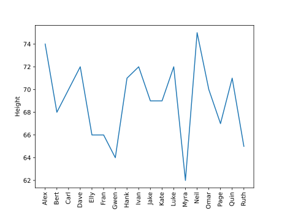
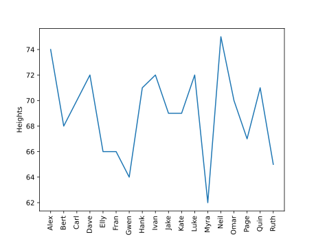

# Python Data Management for Visualizations

In python, there are several ways that data can be interpreted
in order to generate the graphics for data visualization. 

Through several examples, we will show how to manage different
types of data and how to best interact with them. They are lists, dictionaries
and CSV files.

## Lists

Lists are clumps of continuous values that are put directly next to each other
in the computer memory system. 

### Construction

In python, lists can be constructed like this:

```python
example_list = ['example' , 2, 'b', 45, False]
```

Lists have order and can hold many types (bool, int, String, etc.) of values.

### Accessing Values
In python, it is easy to access values within a list. The following code provides an 
example of how to access certain values within a list:

```python
index_4 = example_list[4]
```

It is important to note that lists have indices, which range from 0 to 
the length of the list - 1. The indices provide access to values within 
the list. 

### Updating Values
To update a value within a list, simply utilize same brackets:

```python
example_list[3] = 'bear'
```

This will change the value at the third index from 45 to bear. 

### Python Built-In Methods

Python has several built-in methods for lists. These include `append()`, `clear()`
`copy()`, `count()`, `extend()`, `index()`, `insert()`, `pop()`, `remove(`, `reverse()`,
and `sort()`. 

A user can utilize these methods to make changes in the necessary ways to the list. 

### Examples

## Dictionaries

Dictionaries are like specialized lists. They hold a key-value pair that allows for a user
to look up a key and find the associated value. Dictionaries are useful for storing values
in a way that is more organized than a linear list. Furthermore, dictionaries make it easy
for users to look up the necessary information. 

### Construction

In python, dictionaries are constructed as follows:

```python
example_dictionary = {'motorcycles': 2, 'autocycles': 3, 'cars': 4, 'small_trucks': 6
                      'large_trucks': '18'}
```

The string values are the keys, which provide access to the values within the dictionary.
The colon provides the computer with the command for assigning key-value pair. 

### Accessing Values

There are several built-in commands to access both the keys and values in a dictionary. 
They are as follows:

```python
example_dictionary.get()
example_dicionary.keys()
example_dictionary.values()
```

The `.get()` method returns the value that is associated with the given key, the `.keys()` 
method returns a list of the keys alone, and the `.values()` method returns a list 
of the values alone. There are more methods (see the Python Built-In Methods section)

### Updating Values

To update the dictionary, there is one method that can be used:

```python
example_dictionary.update({'motorcycles': 20})
```

This will update the value associated with this particular key-value pair. 

### Python Built-In Methods

There are several built-in methods that allow for more dictionary manipulation:
They are `clear()`, `copy()`, `fromkeys()`, `items()`, `pop()`, `popitem()`, and 
`setdefault()`.

### Examples


## CSV Files 

CSV stands for "comma-separated-values" and is a data structure that is incredibly
common for data management and analysis. There are many ways to access CSV files. 
The most common way is to use pandas, a python library. However, python also has a 
built-in CSV module that can be used. We will show examples of using both below. 

### Installing and Importing

Before beginning with any of these CSV manipulation tasks, it is necessary to 
install and import the correct modules and libraries. The following showcases this:

```bash
$ pip install pandas
```

```python
import pandas as pd 
import csv
```

### Construction

CSV files are files that exist elsewhere and have already been created. 
Therefore, for creation, we are not creating a CSV files, but rather deconstructing it
into something that is usable. 

In pandas, this means creating a dataframe, which is essentially and indexed table. 
In the python `csv` module, this means using the `csvreader` object within the module. 
Following are two examples showcasing how exactly to do this. 

For the `csv` module:

```python
file = open('/Users/jacksonmiskill/Downloads/biostats.csv') # opens the csv and creates the reader object for it
reader = csv.reader(file)
```

The `reader` is an object that was created by python developers to help parse through
the `csv` files. 

For the `pandas` module:

```python
file = pd.read_csv("/Users/jacksonmiskill/Downloads/biostats.csv")
df = pd.DataFrame(file)
```

### Accessing Values

For the `csv` module:

It is more challenging to access files using the `csv` module as opposed to the 
`pandas` library. To make it more simple, it is necessary to convert the values 
that lie within the `csv` into a list in order to access. 

```python
data = []
for each_row in reader:
    if each_row: # you have to check for blank lines within the document
        data.append(each_row[2])

print(data)
```

For the `pandas` module, it is less complicated to access that values. This 
is because the module includes a function that converts the data into a dataframe. 
After converting, you can use the various methods that are within the dataframe
to essentially pass in the correct values. 

### Examples

Once the `csv` values have been accessed, creation of the graphics can begin. Starting 
with the `csv` module and then moving into `pandas` the following will demonstrate this
action. 

The `csv` file that will be utilized for the following examples can be found
[here](https://people.sc.fsu.edu/~jburkardt/data/csv/csv.html). It represents made up data
on a group of made up people such as age, height, and weight. 

It is relatively easy, but slow, to create graphs with the `csv` module:

```python
from matplotlib import pyplot as plt
import seaborn as sns

names = []
sex_data = []
age_data = []
height_data = []
weight_data = []

with open('/Users/jacksonmiskill/Downloads/biostats.csv',
          'r') as file:  # opens the csv and creates the reader object for it
    reader = csv.reader(file, delimiter=',')

    for each_row in reader:
        if each_row:  # you have to check for blank lines within the document

            names.append(each_row[0])
            sex_data.append(each_row[1])
            age_data.append(each_row[2])
            height_data.append(each_row[3])
            weight_data.append(each_row[4])

# Have to clean the data in order to actually create the graphs. 
names.pop(0)
height_data.pop(0)
for i in range(0, len(height_data)):
    height_data[i] = int(height_data[i])

# let's plot the heights and weight of everyone. We could maybe use a hue here to denote who it is
plt.plot(names, height_data)
plt.xlabel("Name")
plt.ylabel("Height")
plt.xticks(rotation=90)
plt.savefig('images/csv-lineplot.png')
plt.savefig('images/csv-lineplot.svg')
plt.savefig('images/pandas-lineplot.pdf')
plt.legend()
plt.title("Names and Corresponding Height")
plt.show()
```

This code can be access from [GitHub](https://github.com/cybertraining-dsc/reu2022/blob/main/project/graphics/data-management/python-data.py)

This code produces Figure *csv-lineplot*:



Figure *csv-lineplot*: created using the data available [here](https://people.sc.fsu.edu/~jburkardt/data/csv/csv.html). 


***How do we use csv module without having to clean the data? ***


It is so much more simple to accomplish this with the `pandas` library:

```python
file = pd.read_csv("/Users/jacksonmiskill/Downloads/biostats.csv")
biostats = pd.DataFrame(file)

plt.plot(biostats['Name'], biostats[' "Height (in)"'])
plt.xlabel("Name")
plt.ylabel("Height")
plt.xticks(rotation=90)
plt.savefig('images/pandas-lineplot.png')
plt.savefig('images/pandas-lineplot.svg')
plt.savefig('images/pandas-lineplot.pdf')
plt.title("Names and Corresponding Height")
plt.show()
```

This code can be accessed from [GitHub](https://github.com/cybertraining-dsc/reu2022/blob/main/project/graphics/data-management/python-data.py)

This code produces the Figure *pandas-lineplot*:



Figure *pandas-lineplot*: created using the data available [here](https://people.sc.fsu.edu/~jburkardt/data/csv/csv.html). 
Figure *pandas-lineplot*: created using the data available [here](https://people.sc.fsu.edu/~jburkardt/data/csv/csv.html). 


## Sources

### Lists

* <https://towardsdatascience.com/python-basics-6-lists-and-list-manipulation-a56be62b1f95>
* <https://www.w3schools.com/python/python_ref_list.asp>

### Dictionaries

* <https://www.pythonforbeginners.com/dictionary/dictionary-manipulation-in-python>
* <https://www.w3schools.com/python/python_ref_dictionary.asp>
* <https://www.w3schools.com/python/ref_dictionary_update.asp>

### CSV Files

* <https://www.geeksforgeeks.org/creating-a-dataframe-using-csv-files/>
* <https://docs.python.org/3/library/csv.html#examples>
* <https://people.sc.fsu.edu/~jburkardt/data/csv/csv.html>
* <https://docs.python.org/3/library/functions.html#open>
* <https://www.protechtraining.com/blog/post/python-for-beginners-reading-manipulating-csv-files-737#extracting-information-from-a-csv-file>
* <https://stackoverflow.com/questions/13039392/csv-list-index-out-of-range>
* <https://www.geeksforgeeks.org/visualize-data-from-csv-file-in-python/>