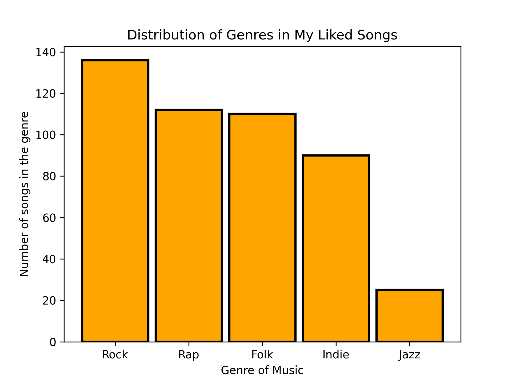

# Matplotlib

Matplotlib is the main plotting library that allows the user to
visualize data. Matplotlib creates figures that can be manipulated and
transformed. This includes manipulations of axes, labels, fonts, and
the size of the images.

## Installation

To install matplotlib, please use the command:

```bash
$ pip install matplotlib
```

## Import Statements

The user will need to supply these import statements at the top of
their code in order for Matplotlib to be imported.

```python
import matplotlib.pyplot as plt
import numpy as np
```

## Bar Chart

In Matplotlib, it is easy to create bar charts. For example, this is a
demonstration of a simple bar chart using data from a user using
Spotify.

```python
import matplotlib.pyplot as plt

# you can also do this: from matplotlib import pyplot as plt

data = {'Rock': 136, 'Rap': 112, 'Folk': 110, 'Indie': 90, 'Jazz': 25}
categories = data.keys()
count = data.values()

# Creating the bar chart
plt.bar(categories,
        count,
        align='center',
        color='darkorange',
        width=0.4,
        edgecolor="royalblue",
        linewidth=4)

# Editing the bar chart's title, x, and y axes
plt.xlabel("Genre of Music")
plt.ylabel("Number of songs in the genre")
plt.title("Distribution of Genres in My Liked Songs")
plt.show()
```

This program can be downloaded from
[GitHub](https://github.com/cybertraining-dsc/reu2022/tree/main/project/graphics/examples/matplotlib-barchart.py). 
The output of this program is showcased in @fig:matplotlib-barchart2.


{#fig:matplotlib-barchart2 width=50%} 

## Line Chart

The Matplotlib library in python allows for comprehensive line plots
to be created. Here a line chart was created using a for loop to
generate random numbers in a range and plot it against the `x` and `y`
axis to display the changes between two variables/data sets.

```python
import matplotlib.pyplot as plt
import random

x = []
y = []
for i in range(0, 100):
  x.append(i)
  value = random.random() * 100
  y.append(value)

# creating the plot and labeling axes and title
plt.plot(x, y)
plt.xlabel("x")
plt.ylabel("y")
plt.title("Plot Test")
plt.show()
```

This program can be downloaded from
[GitHub](https://github.com/cybertraining-dsc/reu2022/tree/main/project/graphics/examples/matplotlib-linechart.py).

The output of this program is showcased in @fig:matplotlib-linechart.

{#fig:matplotlib-linechart width=50%} 


## Pie Chart

A pie chart is most commonly used when representing the division of
components that form a whole thing e.g. showing how a budget is broken
down into separate spending categories. In Matplotlib, the function
`pie()`creates a pie chart. In the following code example, a user's
Spotify data will be displayed as a pie chart.

```python
import matplotlib.pyplot as plt

data = {'Rock': 136, 'Rap': 112, 'Folk': 110, 'Indie': 90, 'Jazz': 25}
categories = data.keys()
count = data.values()

# Creating the pie chart
plt.pie(count, labels=categories)

plt.show()
```

This program can be downloaded
from [GitHub](https://github.com/cybertraining-dsc/reu2022/tree/main/project/graphics/examples/matplotlib-piechart.py).
The output of this program is showcased in @fig:matplotlib-piechart.


{#fig:matplotlib-piechart width=50%} 

## Contour Plot

Unlike the previous types of plots shown, contour plots allow data
involving three variables to be plotted on a 2D surface. In this
example, an equation of a hyperbolic paraboloid is graphed on a
contour plot.

```python
import matplotlib.pyplot as plt
import numpy as np

# creating an equation for z based off of variables x,y
x, y = np.meshgrid(np.linspace(-10, 10), np.linspace(-10, 10))
z = 9 * (x ** 2 + 1) + 8 * x - (y ** 2)
levels = np.linspace(np.min(z), np.max(z), 15)

# creating a contour graph based off the equation of z
plt.contour(x, y, z, levels=levels)

plt.xlabel("x")
plt.ylabel("y")
plt.title("Function of z(x,y)")
plt.show()
```

This program can be downloaded from
[GitHub](https://github.com/cybertraining-dsc/reu2022/tree/main/project/graphics/examples/matplotlib-contour.py). The output of this program is showcased in @fig:matplotlib-contour.

{#fig:matplotlib-contour width=50%}

A contour plot allows data and equations consisting of three variables
to be plotted through plotting 3D surfaces as 2D slices on a `xy`
plane. Matplotlib can display data and equations through contour
graphs after they are inputted. Shown below are the parameters for
`plt.contour`.

```python
plt.contour([x, y], z, levels)
```

The independent variables `x` and `y` must be defined so the dependent
variable `z` can be defined. The variables can come in the form of a
list or dictionary or as an equation. The `levels` parameter
determines the number of contour lines that can be drawn.

## Annotations

### Titles

Titles enable to add a title to the graph. NOte that in most academic 
publications titles are not used and instead the information is added 
to a separate caption for the figure.
Nevertheless, to add a title to your whole graph in matplotlib,
simply type:

```python
plt.title("Title you want to set").
```

### XY Labels

To se an X and Y Labeel which are needed foa all publisations you can set them with 

```python
plt.xlabel("Label you want to set")
plt.ylabel("Label you want to set")
```

### Legend

In case you have multiple graohs you will also want to provide some information about them in a legend:

```python
plt.legend()
```

### Rotating Ticks

When a chart is created, ticks are automatically created on the
axes. By default, they are set horizontally; however, they can be
rotated using `plt.xticks(degrees)` for the `x-axis` or
`plt.yticks(degrees)` for the `y-axis`. 

```python
import matplotlib.pyplot as plt

x = range(0, 4)
y = x
plt.plot(x, y)

# Rotating Ticks
plt.xticks(rotation=90)
plt.yticks(rotation=45)

plt.xlabel('x values')
plt.ylabel('y values')
plt.title(r'$y=x$')
plt.show()
```

This program can be downloaded from [GitHub](https://github.com/cybertraining-dsc/reu2022/blob/main/project/graphics/examples/rotatingticks.py).

The output of this program is showcased in @fig:matplotlib-rotatingticks.

{#fig:matplotlib-rotatingticks  width=50%}

## Export

Saving Chart as files is easy with the command:

```python
plt.savefig("fname", dpi=300)
```

The name and format of the file are set as a string using
`fname`. Make sure to specify the format of the file by using a `.`
after the file name and specify the type after such as `.pdf`, `.png`,
`svg`, etc.

The parameter `dpi` sets the DPI (Dots per Inch) of the image being
saved. Specify this number in the form of a float. For example, set
`dpi=300`.
Please note that we always want o print the png, SVG, and PDF as dependent 
on publisher one or the other is preferred. The best way to deal with this is to 
create a custom save plot function such as 

```python
import matplotlib.pyplot as plt

def save_plt(name):
  plt.savefig(f'{name}.png', dpi=300)
  plt.savefig(f'{name}.pdf')
  plt.savefig(f'{name}.svg')
  plt.show()
```

This code can be accessed on
[GitHub](https://github.com/cybertraining-dsc/reu2022/tree/main/project/graphics/examples/matplotlib-linechart.py)

### Display

The `plt.show()`
displays the graph on screen:

```python
plt.show()
```

## Links

* <https://matplotlib.org/> [@www-matplotlib]
* <https://matplotlib.org/stable/api/pyplot_summary.html> [@www-matplotlib-documentation]
* <https://www.activestate.com/resources/quick-reads/what-is-matplotlib-in-python-how-to-use-it-for-plotting/> [@www-matplotlib-activestate]
* <https://www.geeksforgeeks.org/bar-plot-in-matplotlib/> [@www-matplotlib-barplot]

