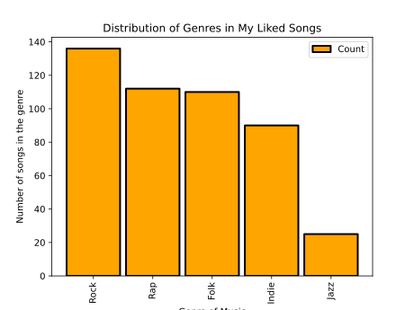
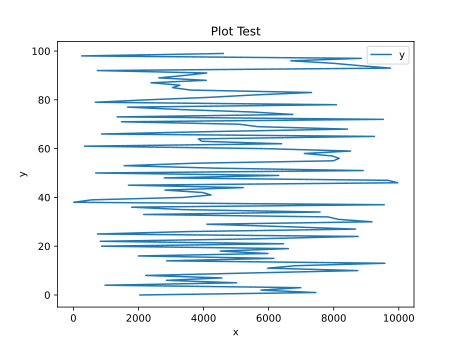
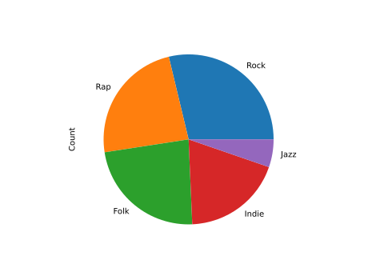

# Pandas Graphics

Pandas is a useful library for working with data. It relies on storing
data in data frames. Instead of using a set of ordered pairs, a data
frame in Pandas is similar to an Excel Spreadsheet or an SQL data
frame and supports multiple rows and columns in a tabular fashion.

Visualization for Panda's data frames are an important tool for
understanding the data set. Panda's visualization tools are based off
of Matplotlib, so many of the plotting functions are the same.

## Installation
To install Pandas, please use the command:

```bash
$ pip install pandas
```

## Import Statements

The user will need to import both Pandas and Matplotlib in order to
create and visualize data frames. In addition, Python's `numpy` may be
a useful library for mathematical procedures on the data.

```python
import matplotlib.pyplot as plt
import pandas as pd
import numpy as np
```

## Bar Chart

Creating a bar chart with data frames is similar to creating bar
charts with Matplotlib, with a couple differences in how you
manipulate the data. In the following program, we use the same data
and modifications as the [Matplotlib bar chart
example](https://github.com/cybertraining-dsc/reu2022/blob/main/project/graphics/examples/matplotlib-barchart.py)
that can be found on Github.

```python
import matplotlib.pyplot as plt
import pandas as pd

data = {'Rock': 136, 'Rap': 112, 'Folk': 110, 'Indie': 90, 'Jazz': 25}
categories = data.keys()
count = data.values()

df = pd.DataFrame({'Count':count, 'Categories':categories})

# Creating the bar chart
df.plot.bar(
        x='Categories',
        y='Count',
        align='center',
        color='orange',
        width=0.9,
        edgecolor="black",
        linewidth=2)

# Editing the bar chart's title, x, and y axes
plt.xlabel("Genre of Music")
plt.ylabel("Number of songs in the genre")
plt.title("Distribution of Genres in My Liked Songs")
plt.show()
```

This program can be downloaded from
[GitHub](https://github.com/cybertraining-dsc/reu2022/tree/main/project/graphics/examples/pandas-barchart.py). The output of this program is showcased in Figure [@fig:pandas-barchart].

{#fig:pandas-barchart width=50%}

Note the differences in creating the chart. Since data frames support
multiple dimensions of data, the x and y we want to graph must be
specified in `df.plot.bar()`. However, editing the title and axes are
the same as in Matplotlib.

## Line Chart

A line chart is typically used for time series data and
non-categorical data. Pandas supports line chart visualization with
`plot.line()`. We use the same data and modifications as the
[Matplotlib line chart
example](https://github.com/cybertraining-dsc/reu2022/blob/main/project/graphics/examples/matplotlib-linechart.py)
that can be found on Github. Note that since this data relies on
random number generation the graphs will look slightly different each
time.

```python
import matplotlib.pyplot as plt
import pandas as pd
import random

x = []
y = []
for i in range(0, 100):
    x.append(i)
    value = random.random() * 100
    y.append(value)


df = pd.DataFrame({'x':x, 'y':y})

# creating the plot and labeling axes and title
df.plot.line(x='x', y='y')
plt.ylabel("y")
plt.title("Plot Test")

plt.show()
```

This program can be downloaded from
[GitHub](https://github.com/cybertraining-dsc/reu2022/tree/main/project/graphics/examples/pandas-linechart.py). The output of this program is showcased in Figure [@fig:pandas-linechart].

{#fig:pandas-linechart width=50%}


## Pie Chart

A pie chart is useful for showing a divison of a whole. Data that can
be represented by a pie chart can also be used to make a bar chart,
since both typically use categorical counts. Pandas uses `plot.pie()`
to make a pie chart, in a manner similar to `plot.bar()`. We use the
same data used to create the line chart for this visualization.

```python
import matplotlib.pyplot as plt
import pandas as pd

data = {'Rock': 136, 'Rap': 112, 'Folk': 110, 'Indie': 90, 'Jazz': 25}
categories = data.keys()
count = data.values()

df = pd.DataFrame({'Count':count},index=categories)
plot = df.plot.pie(y='Count',legend=None)
save()
```

This program can be downloaded from
[GitHub](https://github.com/cybertraining-dsc/reu2022/tree/main/project/graphics/examples/pandas-piechart.py). The output of this program is showcased in Figure [@fig:pandas-piechart].

{#fig:pandas-piechart width=50%}

Note that instead of listing both the Categories and the Count as
data, we use the categories as index. This gets the proper labeling
for our pie chart. In addition, Pandas automatically adds a legend,
but this is unnecessary so we can remove the legend by setting the
parameter `legend=None` in `plot.pie()`.

## Exporting

Note that this is the same as the Matplotlib tutorial found
[here]((https://github.com/cybertraining-dsc/reu2022/tree/main/project/graphics/examples/pandas-linechart.py))
on Github.

To export your graph as an image file, you can use the Matplotlib
function `savefig("fname.x")`. You can specify the file type by
filling in `.x` with `.pdf`, `.png`, `svg`, etc.

The parameter `dpi` sets the DPI (Dots per Inch) of the image being
saved. Specify this number in the form of a float. For example, set
`dpi=300`.

Additionally, there is another way to save files that may be faster
than calling a specific method for each file. The following code
showcases this:

```python
import matplotlib.pyplot as plt
import os
from matplotlib import pyplot


def save():
    name = os.path.basename(__file__).replace(".py", "")
    plt.savefig(f'/filepath/{name}.png')
    plt.savefig(f'filepath/{name}.pdf')
    plt.savefig(f'filepath/{name}.svg')
    plt.show()
```

This code can be accessed on
[GitHub](https://github.com/cybertraining-dsc/reu2022/tree/main/project/graphics/examples/pandas-linechart.py)

The very last command is `plt.show()`, as this command displays the
graph that you made. To show, simply type:

```python
plt.show()
```

## Links

* <https://pandas.pydata.org/pandas-docs/stable/reference/api/pandas.DataFrame.plot.bar.html>
* <https://pandas.pydata.org/pandas-docs/stable/reference/api/pandas.DataFrame.plot.line.html>
* <https://pandas.pydata.org/pandas-docs/stable/reference/api/pandas.DataFrame.plot.pie.html>