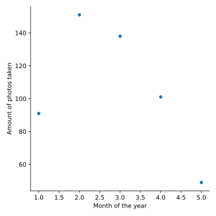
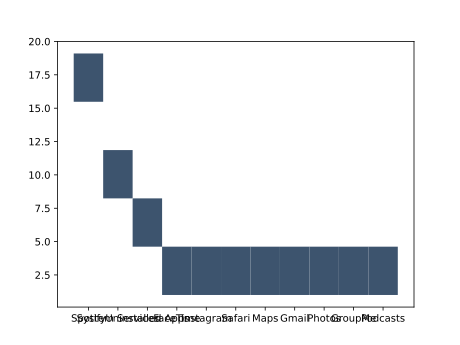
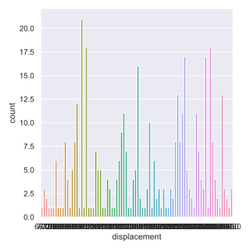

# Python Graphics

TODO: Remove contractions (I, you, we, etc.)
TODO: Grammarly for sections

In Python, data and equations can be visually represented using graphs
and plots.  Whereby showcasing how to use different plotting libraries,
this includes Matplotlib, Bokeh, and Seaborn.

## Matplotlib

Matplotlib is a library that allow the user to visualize data. 
The library can create pie charts, bar charts, line
plots, and other graphs specifically for data visualization. 
Matplotlib creates figures that can be manipulated and transformed.
This includes manipulations of axes, labels, fonts and the size 
of the images. 

### Installation

To install matplotlib, please use the command:

```bash
$ pip install matplotlib
```

### Bar Chart

In matplotlib it is easy to create bar charts. For example this is a demonstration of a simple 
bar chart using data from a user using Spotify. 

```python
import matplotlib.pyplot as plt

# you can also do this: from matplotlib import pyplot as plt

data = {'Rock': 136, 'Rap': 112, 'Folk': 110, 'Indie': 90, 'Jazz': 25}
categories = data.keys()
count = data.values()

# Creating the bar chart
plt.bar(categories, 
        count, 
        align='edge', 
        color='darkorange', 
        width=0.4, 
        edgecolor="royalblue", 
        linewidth=4)

# Editing the bar chart's title, x, and y axes
plt.xlabel("Genre of Music")
plt.ylabel("Number of songs in the genre")
plt.title("Distribution of Genres in My Liked Songs")
plt.show()
```

This program can be downloaded from [GitHub](https://github.com/cybertraining-dsc/reu2022/tree/main/project/graphics/examples/matplotlib-barchart.py)

The output of this program is showcased in Figure *barchart*.


Figure *barchart*: Barchart created from data from Spotify

The bar chart is a graph that visualizes data
by displaying the quantity of several variables through different sized 
rectangles. Matplotlib essentially creates the bar chart object as a figure, 
and then displays that figure on the computer. plt.barchart takes in a multitude 
of parameters. 


### Line Chart 

The matplotlib library in python allows for comprehensive line plots
to be created.  Here a line chart was created using a for loop to
generate random numbers in a range and plot it against the `x` and `y`
axis to display the changes between two variables/data sets.

```python
import matplotlib.pyplot as plt
import random

x = []
for i in range(0, 100):
    value = random.random() * 10000
    x.append(value)

# creating a list of 100 numbers in order from 0 to 100
y = []
for j in range(0, 100):
    y.append(j)

# creating the plot and labeling axes and title
plt.plot(x, y)
plt.xlabel("x")
plt.ylabel("y")
plt.title("Plot Test")
plt.show()
```

This program can be downloaded from [GitHub](https://github.com/cybertraining-dsc/reu2022/tree/main/project/graphics/examples/matplotlib-linechart.py)

The output of this program is showcased in Figure *linechart*.


Figure *linechart*: Linechart created from random variables

The line chart using the matplotlib library allows for multiple data
sets to be contrasted against each other in the same graph. The line
chart is positioned based on the np.linspace which takes in two total
parameters that determine the starting point and the end point and an
optional parameter that defines the total generated sample between the
start/end points. With this, the variables and data sets can be
plotted and modified to shape the steepness of the curve and its
growth rate–exponential, polynomial, logarithmic, s-curved etc.

```python
x = np.linspace(start,end,samples between start-finish)
plt.plot(x, y)
```

Instead of only plotting a linear line, there is a choice to
include multiple points of x-values that relate to its
corresponding y-values. As mentioned, functions can be 
incorporated to adjust the line's properties either by 
addition, subtraction, division or multiplication. Optional 
parameters for better visualization in a line chart includes
the modification of the linestyle, and can be adjusted based 
on the viewer's preference–dotted line, dashed, dashed with
dots or none). 


### Pie Chart

A pie chart is most commonly used when representing the division of
components that form a whole thing e.g. showing how a budget is broken
down into separate spending categories. In matplotlib, the `pie()`
function creates a pie chart.  In the following code example, a user's
Spotify data will be displayed as a pie chart.

```python
import matplotlib.pyplot as plt

data = {'Rock': 136, 'Rap': 112, 'Folk': 110, 'Indie': 90, 'Jazz': 25}
categories = data.keys()
count = data.values()

# Creating the pie chart
plt.pie(count, labels=categories)

plt.show()
```

This program can be downloaded from [GitHub](https://github.com/cybertraining-dsc/reu2022/tree/main/project/graphics/examples/matplotlib-piechart.py)

The output of this program is showcased in Figure *piechart*.


Figure *piechart*: Barchart created from data from Spotify

The pie chart is a graph that visually displays multiple 
quantities of data as a proportion to the total amount, 
represented as the whole circle, with each quantity shown as a
proportional slice of it. Matplotlib has the ability to display 
data through a pie chart as a figure after data is inputted. 
The command plt.pie takes in many parameters. Here are some of 
the parameters used in plt.pie, from matplotlib API online, 
not all of them are shown here.

```python
plt.pie(x, labels, colors, normalize, startangle, radius, center)
```

Here, the first parameter `x` is the parameter that consists of
the data being plotted, which should be in the form of a list or 
dictionary as it be multiple quantities of data. Each slice of 
the pie can be labeled. To do so, labels must be in the form of 
a list of strings in the same corresponding order as the data. 
The sequence of colors of the slices can be set using the command
`plt.get_cmap("Colors")`. There is also the choice of making 
the pie chart a full pie or not using normalize. Setting it to
True, which is the default, makes it a full pie, False makes 
it not a full pie. The angle of the start of the pie, set 
counterclockwise from the x-axis can be set using startangle.
The radius of the pie can be set using radius and setting it 
to a float. The coordinates of the center of the chart can be 
set in the form `(float, float)`. 

#### Contour Plot

Unlike the previous types of plots shown, contour plots allows
data involving three variables to be plotted on a 2D surface.
In this example, an equation of a hyperbolic paraboloid is
graphed on contour plot.

```python
import matplotlib.pyplot as plt
import numpy as np

#creating an equation for z based off of variables x,y
x, y = np.meshgrid(np.linspace(-10, 10), np.linspace(-10, 10))
z = 9*(x**2+1)+8*x-(y**2)
levels = np.linspace(np.min(z), np.max(z), 15)

#creating a contour graph based off the equation of z
plt.contour(x,y,z, levels=levels)


plt.xlabel("x")
plt.ylabel("y")
plt.title("Function of z(x,y)")
plt.show()
```

This program can be downloaded from [GitHub](https://github.com/cybertraining-dsc/reu2022/tree/main/project/graphics/examples/matplotlib-contour.py)

The output of this program is showcased in Figure *contourplot*.


Figure *contourplot*: Multivariable (x, y, z) Equation Plotted

A contour plot allows data and equations consisting of three
variables to be plotted through plotting 3D surfaces as 2D 
slices on an xy plane. Matplotlib has the ability to display 
data and equations through contour graphs after they are 
inputted. Shown below are the parameters for plt.contour.
```python
plt.contour([x, y], z, levels)
```

The independent variables x and y must be defined so the 
dependent variable z can be defined. The variables can 
come in the form of a list or dictionary or as an equation.
The levels parameter determines the number of contour lines
that can be drawn. 

## Titles, Labels, and Legends 

### Titles

Titles are necessary to let the reader know about your graph or 
plot is exactly about. To give a title to your whole graph in 
matplotlib, simply type:
```python
plt.title("Title you want to set").
```

### x-axis labels and y-axis labels

Within the matplotlib library are the functions plt.xlabel() and 
plt.ylabel(). All these functions do is set a string to the two 
axes. To use these functions, simply type:

```python
plt.xlabel("Label you want to set")
plt.ylabel("Label you want to set")
```

### Legend

Sometimes, a legend may be necessary to let the reader know which
part of the graph/plot corresponds to each part of the data shown.
To show a legend, use the command:

```python
plt.legend()
```

### Display

The very last command you should put in your code is plt.show(),
as this command displays the graph that you made. To show, simply
type:

```python
plt.show()
```

## Bokeh

Bokeh is a Python library useful for generating visualizations 
for web browsers. It generates graphics for all types of plots 
and dashboards powered by JavaScript without the user’s need to
write any JavaScript code. The guide below will walk you 
through useful Bokeh commands and features.

### Installation
### Import Statements

### Bokeh Plotting Interface

Bokeh.plotting is the library’s main interface. It gives the ability to
generate plots easily by providing parameters such as axes, 
grids, labels. The following code shows some of the simplest 
examples of plotting a line and a point on a chart.

```python
from bokeh.io import show
from bokeh.plotting import figure

# labeling the title, specifying the range of the x-axis, labeling the y-axis, specifying the height to be 500 pxls
p = figure(title = "My Graph", x_range = [0,20], y_axis_label = "the y axis", height = 500)

# plotting a line from (0,0) to (20,20); any of the CSS colors can be used
p.line([0,20],[0, 20], color='indigo')

# plotting a point (circle) at (5,10)
p.circle(5,10, color = 'green')

show(p)
```


### Figure Parameters Example

* <b>x_axis_label</b> and <b>y_axis_label</b>: labels for the
x and y axis
* <b>x_range</b> and <b>y_range</b>: specifications for the range of the x and y axis
* <b>title</b>: text title for your graph
* <b>width</b> and <b>height</b>: width and height of your graph in pixels
* <b>background_fill_color</b>: the background of the figure (takes any CSS colors)

### Saving Figures

Bokeh also supports outputs to a static HTML file with a
specific name.

```python
from bokeh.plotting import output_file
output_file("name.html")
```

After importing the Bokeh plotting interface, it is possible to be
able to create different types of plots utilizing the figure
created with the figure function.

### Scatter Plot

The Bokeh library provides various marker shapes for marking
points on the scatter plot. The example below demonstrates
how to create a scatter plot with two points at locations 
(1,3) and (2,4) respectively with circular and square marker
shapes. The size parameter controls the size of the marker.

```python
# Circle
p.circle([1,2], [3,4], size = 10)

# Square
p.square([1,2], [3,4], size = 10)
```

The list of all possible marker types and the functions used 
to create them can be found here:
<http://docs.bokeh.org/en/latest/docs/user_guide/plotting.html>

### Line Plots

The library provides a series of functions for creating various 
types of line plots ranging from a single line plot, step line 
plot, stacked line plot, multiple line plot and so on.
You can create a simple linear line plot connecting the 
points (1,1), (2,2) and (3,3) with the following.

```python
# The line_width parameter sets the width of the line plot.
x = [1,2,3]
y = [1,2,3]
p.line(x, y, line_width = 1)
```
You can find the source code for other types of line plots here:
<http://docs.bokeh.org/en/latest/docs/user_guide/plotting.html>


### Bar Chart

Similarly, the `hbar()` and `vbar()` functions can be used to display
horizontal and vertical bar graphs, respectively.

```python
# The line_color parameter sets the color of the bar graph.
x = [1,2,3]
y = [1,2,3]
p.hbar(x, y, line_color = 'black')
```

## Seaborn

Seaborn, like Matplotlib, is a data visualization tool. However,
the graphs and charts that Seaborn can create are more complex
than Matplotlib. The graphs that are created in Seaborn are
more statistically detailed. Unlike matplotlib, Seaborn draws
upon other imported libraries such as Matplotlib, Numpy, and Pandas.
This is because Seaborn relies on more complex math (Numpy) and 
dataframes (generated from Pandas) that are passed into its functions
as the data. 

There are several types of plots that can be made from Seaborn; they are
relational, distributional, categorical, regression, and matrix
plots.

We have created examples to demonstrate the abilities of Seaborn. 
The data that is used for these examples comes from the makeup 
of a user's storage on their phone. 


### Installation

Seaborn can be installed in the exact same way as the other 
libraries installed earlier. The user who is installing the
library should make sure that it is being installed in the 
correct environment. 

```bash
$ pip install seaborn
```

### Import Statements

The user will need to supply these import statements at the top
of their code in order for Seaborn to be imported. 

```python
import seaborn as sns
import matplotlib.pyplot as plt
```

To showcase a few methods in Seaborn, two unique sets of data will be 
created. The first set of data represents how a user's phone storage is
allocated and the second set represents how a user has used the photos
application over the past 5 months. 

```python
# the data represents how storage is allocated on a user's phone

source = ['Spotify', 'System Services', 'Uninstalled Apps', 'FaceTime', 'Instagram', 'Safari',
          'Maps', 'Gmail', 'Photos', 'GroupMe', 'Podcasts']

value = [19.1, 10.9, 7.4, 4.3, 4.1, 3.9, 3.0, 1.8, 1.6, 1.3, 1.0]
use = ['Yes', 'No', 'No', 'Yes', 'Yes', 'Yes', 'Yes', 'Yes', 'Yes', 'Yes', 'No']

# creating a different set of data that reflects how many photos a user took in each month of 2022 up to June

months = [1, 2, 3, 4, 5]
photos = [91, 151, 138, 101, 49]
```

### Relational Plots

Relational plots showcase the relationship between
variables in a visual format. It is a broad term for data 
representation. Examples of relational plots in Seaborn are 
`relplot` `lineplot` and `scatterplot`. 

It is simple to create a relational plot. A hued line plot can be created
easily with Seaborn. 

```python
sns.relplot( x=months , y=photos)
plt.xlabel("Month of the year")
plt.ylabel("Amount of photos taken")
plt.show()
```
Which produces:




### Distribution Plots

A distribution plot shows how the data is concentrated in
a range of values. The graph that appears looks similar to a bar
graph in that there are bars. However, these bars show concentration of a 
variable across a range of values rather than the quantity possessed by 
a singular variable. The distributional plots in Seaborn are `displot` `histplot`
`kdeplot` `ecdfplot` and `rugplot`.

```python
sns.displot(x=)
plt.show()
```

Which produces:




### Categorical Plots

Categorical plots are statistical graphs that help 
visualize magnitudes of different variables in a dataset. 
A type of categorical plot is a bar chart, exactly like 
the example produced in the Matplotlib section. The categorical plots are
`catplot` `stripplot` `swarmplot` `boxplot` `violinplot` `boxenplot` 
`pointplot` `barplot` and `countplot`.

Categorical plots are relatively simple to implement. 
It is necessary to include the `kind` parameter as it 
specifies the type of categorical plot that will be created.

```python
sns.catplot(x="displacement", data=data, kind="count")
plt.show()
```

Which produces:




### Regression Plots

Regression plots are like relational plots in the way 
that they help visualize the relationship between two 
variables. Regression plots, however, show the linear 
correlation that may or may not exist in a scatter plot
of data. Their regression plots are `lmplot` `regplot` and `residplot`.

Regression plots are simple to implement:

```python
sns.regplot(x=independent_1, y=dependent_1)
plt.show()
```

Which produces:


Each of these plots can be manipulated to the users 
needs via the API that is listed in the sources section. 

### Saving Figures

Saving figures created by Seaborn is quite simple. This is 
because it is the exact same as in Matplotlib. 

To save a figure:

```python
plt.savefig('figure_path/figure_name')
```

## Sources

### Matplotlib

* <https://matplotlib.org/>
* <https://matplotlib.org/stable/api/pyplot_summary.html>
* <https://www.activestate.com/resources/quick-reads/what-is-matplotlib-in-python-how-to-use-it-for-plotting/>
* <https://www.geeksforgeeks.org/bar-plot-in-matplotlib/>

### Seaborn

* <https://seaborn.pydata.org/api.html>
* <https://www.geeksforgeeks.org/python-seaborn-tutorial/>
* <https://www.geeksforgeeks.org/introduction-to-seaborn-python/>
* <https://www.geeksforgeeks.org/plotting-graph-using-seaborn-python/>
* <https://stackoverflow.com/questions/30336324/seaborn-load-dataset>
* <https://github.com/mwaskom/seaborn-data/blob/master/planets.csv>

### Bokeh

* <http://docs.bokeh.org/en/latest/docs/user_guide/plotting.html>
* <http://docs.bokeh.org/en/latest/docs/user_guide/plotting.html>
* <http://docs.bokeh.org/en/latest/>
* <https://docs.bokeh.org/en/latest/docs/reference/plotting/figure.html>


