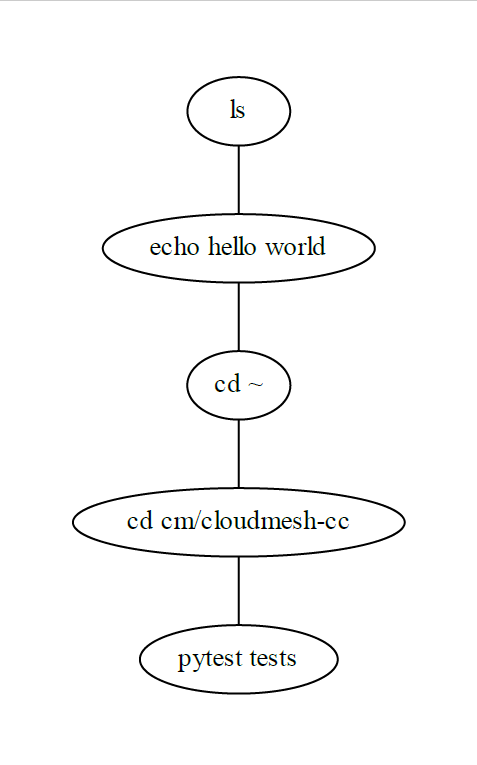

# `graphviz` tutorial

*insert description

## Installation and Importing

In order to install `graphviz` on Windows fully, first, have Chocolatey 
installed. Next, run Command Prompt as an administrator and type in the 
following:

```
choco install graphviz
```

Next, go onto GitBash and type in the following:

```bash
$ pip install graphviz
```

## Creating the graph, adding nodes, and adding edges

Creating a basic graph with nodes and edges is very simple using `graphviz`.
The following example is a synthetic job queueing service. Each node 
represents a job and the edges connect the jobs. 

Nodes can be created using `node()` where the variable of the job can be 
defined and labeled. 

Edges can be created either using `edge()` or `edges()`, as used in this 
example. The commands take in the start and end node variables which will 
create either one or multiple edges, respectively. Edges can be labeled too.

The following is the code that was created:


```python
import graphviz


f = graphviz.Graph('jobs in queues', filename='test-graphviz.gv')

f.node('job-1', 'ls')
f.node('job-2', 'echo hello world')
f.node('job-3', 'cd ~')
f.node('job-4', 'cd cm/cloudmesh-cc')
f.node('job-5', 'pytest tests')
f.edges([('job-1', 'job-2'), ('job-2', 'job-3'), ('job-3', 'job-4'),
         ('job-4', 'job-5')], )

f.view()
```

This code can be accessed via [Github](https://github.com/cybertraining-dsc/reu2022/blob/main/project/graphs/graphs-graphviz/test-graphviz.py).

Shown here is the graph produced from the code:




