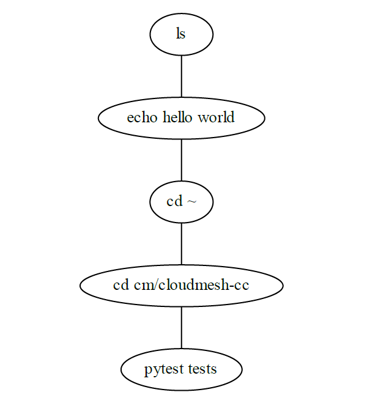
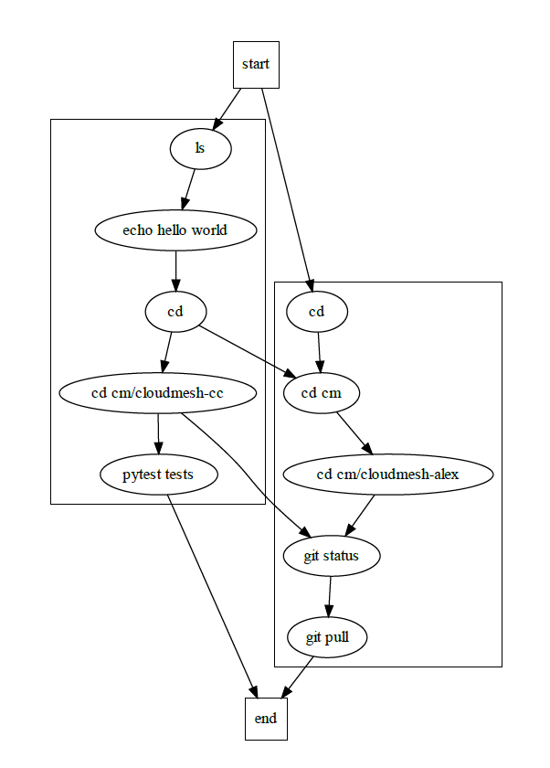

# `graphviz` tutorial

*insert description

## Installation and Importing

In order to install `graphviz` on Windows fully, first, have Chocolatey 
installed. Next, run Command Prompt as an administrator and type in the 
following:

```
choco install graphviz
```

Next, go onto GitBash and type in the following:

```bash
$ pip install graphviz
```

## Creating the graph, adding nodes, and adding edges

Creating a basic graph with nodes and edges is very simple using `graphviz`.
The following example is a synthetic job queueing service. Each node 
represents a job and the edges connect the jobs. 

There are two types that can be made using `graphviz`. Regular graphs can be 
made using `Graph()`. They don't have arrows. Directed graphs can be made 
using `Digraph()`. They do have arrows.

Nodes can be created using `node()` where the variable of the job can be 
defined and labeled. 

Edges can be created either using `edge()` or `edges()`, as used in this 
example. The commands take in the start and end node variables which will 
create either one or multiple edges, respectively. Edges can be labeled too.

The following is the code that was created:

```python
import graphviz

f = graphviz.Graph('jobs in queues', filename='examples/basic-graphviz.gv')

f.node('job-1', 'ls')
f.node('job-2', 'echo hello world')
f.node('job-3', 'cd ~')
f.node('job-4', 'cd cm/cloudmesh-cc')
f.node('job-5', 'pytest tests')
f.edges([('job-1', 'job-2'), ('job-2', 'job-3'), ('job-3', 'job-4'),
         ('job-4', 'job-5')], )

f.view()
```

This code can be accessed via [Github](https://github.com/cybertraining-dsc/reu2022/blob/main/project/graphs/graphs-graphviz/test-graphviz.py).

Shown here is the graph produced from the code:




## Subgraphs

Subgraphs are clusters of nodes and edges that can be created using the 
`subgraph()` command. However, it's important to have the prefix `'cluster'` in 
the name of it.

The following code shows the usage of subgraphs by expanding on the last 
example.

```python
import graphviz

g = graphviz.Digraph('jobs in queues', filename='subgraph-graphviz.gv')

with g.subgraph(name='cluster_1') as s:
    s.node('job-1', 'ls')
    s.node('job-2', 'echo hello world')
    s.node('job-3', 'cd ~')
    s.node('job-4', 'cd cm/cloudmesh-cc')
    s.node('job-5', 'pytest tests')
    s.edges([('job-1', 'job-2'), ('job-2', 'job-3'), ('job-3', 'job-4'),
             ('job-4', 'job-5')], )

with g.subgraph(name='cluster_2') as s:
    s.node('job-6', 'cd')
    s.node('job-7', 'cd cm')
    s.node('job-8', 'cd cm/reu2022')
    s.node('job-9', 'git status')
    s.node('job-10', 'git pull')
    s.edges([('job-6', 'job-7'), ('job-7', 'job-8'), ('job-8', 'job-9'),
             ('job-9', 'job-10')], )


g.edge('start', 'job-1')
g.edge('start', 'job-6')
g.edge('end', 'job-5')
g.edge('end', 'job-10')
g.edge('job-3', 'job-7')
g.edge('job-4', 'job-9')

g.node('start', shape='square')
g.node('end', shape='square')


g.view()
```

This code can be accessed via [Github](https://github.com/cybertraining-dsc/reu2022/blob/main/project/graphs/graphs-graphviz/examples/subgraph-graphviz.py).




## Data Structures

Square data structures can be created in `graphviz` when the shape of the nodes
is set to `'record'`. This specific type of data structure allows for nodes 
to be clustered together in the same rectangle. The following code shows a 
diagram of different files and directories.

```python
import graphviz

s = graphviz.Digraph('files in directories', filename='structure-graphviz.gv')
s.node_attr={'shape' : 'record'}


s.node('s1', '<d1> cloudmesh-cc | <d2> reu2022')
s.node('s2', '{<d1> cloudmesh | <d2> tests}')
s.node('s3', '<d1> contribute | {<d2> graphs |{<d3> graphviz | <d4> networkx}}')

s.edges([('s1:d1', 's2:d2'), ('s1:d2', 's3:d4')])

s.view()
```

This code can be accessed via [Github]()

