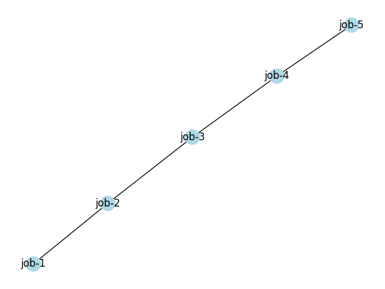

# Networkx

`networkx` is a python library that allows a user to create graphs. The library allows the user to create different kinds of graphs, included directed and undirected. With this in mind, the following is a basic overview of the library. 

## Installing and Importing

Thankfully, `networkx` can be super easily downloaded. Simply execute the following:

```bash
$ pip install networkx
```

## Creating a graph

It is super simple to create a graph, add nodes to the graph, and add edges to the graph. For the purposes of this tutorial, we will be working with a synthetic job queueing service. Each node represents a job and the edges are the edges that connect each job. 

The following is the code that was created:

```python
import networkx as nx

# creating a list of nodes and edges- you have to be extremely careful not to typo
nodes = ['job-1', 'job-2', 'job-3','job-4', 'job-5']

edges = [('job-1', 'job-2'), ('job-2', 'job-3'), ('job-3', 'job-4'),
         ('job-4', 'job-5')]
```

This code can be accessed from [GitHub](https://github.com/cybertraining-dsc/reu2022/blob/main/project/graphs/graphs-networkx/test-networkx.py)

To create the graph and add the above nodes and edges, `networkx` provides super simple methods.

```python
1 import networkx as nx 
2 
3 graph = nx.Graph()  # creates the graph that we will use
4 
5 graph.add_nodes_from(nodes)  # adds the nodes from the dict we created
6 graph.add_edges_from(edges)  # adds the edges from the dict we created
7 
8 print(graph)  # prints: "Graph with 5 nodes and 4 edges"
```

This code can be accessed from [GitHub](https://github.com/cybertraining-dsc/reu2022/blob/main/project/graphs/graphs-networkx/test-networkx.py)

Thus, we have created the graph. 

## Accessing

It is necessary to be able to access the elements within the graph. There is a slightly strange way of going about doing this with `networkx`. Rather than being able to directly access the element you input, it will return the adjacent element. Thus, it seems to be necessary to have a dummy head, which makes it so that the first node inserted into the graph can be accessed. 

The following looks into this:

```python
9 print(graph['job-1'])  # will return {'job-2' : {}}
```

This code can be accessed from [GitHub]()

## Removing nodes

It is very easy to remove nodes and edges using `networkx`. This can be accomplished by executing the following:

```python
import networkx as nx

G = nx.Graph()

# creating a list of nodes and edges- you have to be extremely careful not to typo
nodes = ['job-1', 'job-2', 'job-3', 'job-4', 'job-5']

edges = [('job-1', 'job-2'), ('job-2', 'job-3'), ('job-3', 'job-4'),
         ('job-4', 'job-5')]

print(G)  # will return "Graph with 5 nodes and 4 edges".

G.remove('job-1')

print(G)  # will return "Graph with 4 nodes and 3 edges"
```

This code can be accessed on [GitHub](https://github.com/cybertraining-dsc/reu2022/blob/main/project/graphs/graphs-networkx/test-networkx.py)


## Colors and Labels

It is super simple to add colors and labels, as well as display the networks in a graphic notation. To do so, execute the following code:

```python
color_map = []
for n in nodes:
    color_map.append('lightblue')

nx.draw(G, node_color=color_map, with_labels=True)
plt.show()
```

This code can be accessed on [GitHub](https://github.com/cybertraining-dsc/reu2022/blob/main/project/graphs/graphs-networkx/test-networkx.py)

The `color_map` was created as a list based on the number of nodes in our list of nodes we created before. Thus, it makes it very easy to implement as it allows the user to update individual nodes, if needed.

The code produces the following image:

{#fig:matplotlib-barchart width=50%}


There are many other ways to manipulate the nodes and edges. These ways can be accessed from the official [documentation](https://networkx.org/documentation/stable/index.html)
